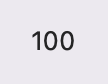
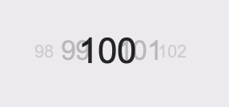

# Chris's SwiftUI Carousel Counter

The Carousel Counter is a SwiftUI View Modifier that changes your view into a caoursel of
numbers.

The important thing to note about this View Modifier is that it DOES NOT use any Scroll View.

Number views are animated from one position to the next

## Overview

```
import SwiftUI
import CarouselCounter

struct MyView: View {
  
  var body: some View {
    Text("100")
      .carouselCounter(value: number) { index, layout in
        
        Text("\(layout.value)")
          .animatableFont(fontName: "Arial", fontSize: 22 * layout.scale)
          .opacity(layout.opacity)
          .zIndex(layout.zIndex)
        
      }
      .animation(Animation.easeIn, value: number)
  }
  
}
```

| Before | After |
|--------|-------|
|
